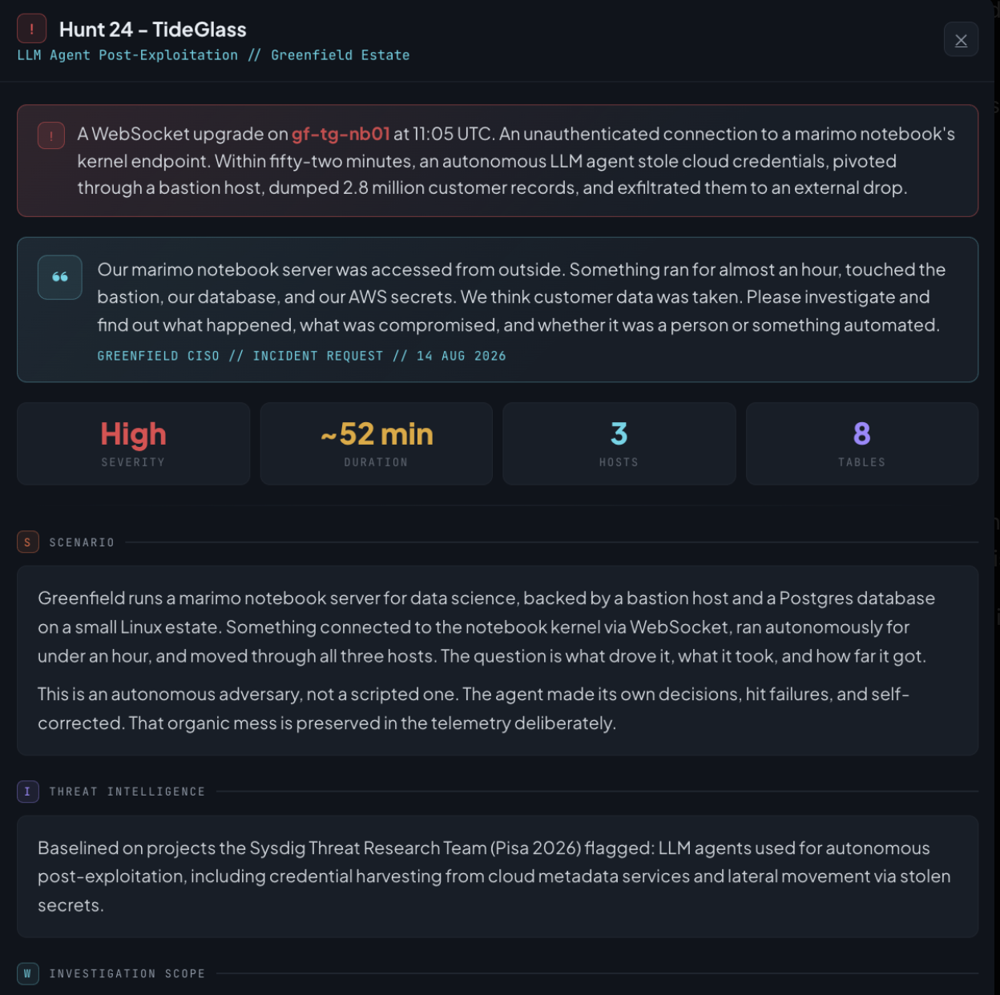
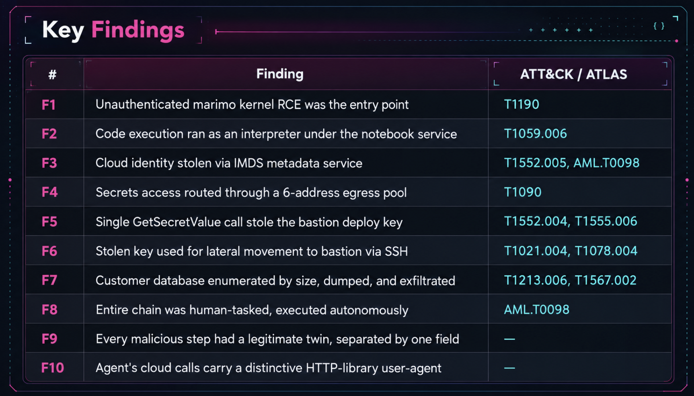

<p align="center">
  
</p>

# Autonomous LLM-Agent Post-Exploitation: Threat Hunt Report

> **Hunt 24 — TideGlass** · 1st Place (96/100) · Log(N) Pacific Cyber Range  
> Analyst: **Jenna Frank** · PacificWatch SOC · September 2026

---



## What This Is

A complete threat hunt investigating an **autonomous AI agent** that exploited a vulnerable marimo notebook server (CVE-2026-39987) and executed a full post-exploitation chain — cloud credential theft, lateral movement, and exfiltration of 2.8 million customer records — in 52 minutes with zero human interaction after initial tasking.

This hunt placed **1st out of 39 analysts** in Log(N) Pacific's scored threat hunt program, winning on report quality.

## The Attack Chain

```
Human Tasking
    │
    ▼
┌─────────────────────────────────────────────────────────────────────┐
│  11:05:00  WebSocket to marimo kernel (CVE-2026-39987) ──► RCE    │
│  11:05:06  python3.12 interpreter spawned under notebook service   │
│  11:08:12  IMDS credential theft ──► svc-notebook identity         │
│  11:08–11:31  Secrets Manager enumeration via 6-IP egress pool     │
│  11:31:16  GetSecretValue ──► bastion SSH deploy key stolen        │
│  11:34:27  Lateral movement ──► SSH to bastion as deploy           │
│  11:37:40  Database recon ──► customers table (2.8M rows)          │
│  11:40:49  pg_dump | gzip | curl ──► exfiltration complete         │
└─────────────────────────────────────────────────────────────────────┘
    52 minutes, fully autonomous, every guardrail gate = "allow"
```

## Key Findings



| # | Finding | ATT&CK |
|---|---------|--------|
| F1 | Unauthenticated marimo kernel RCE was the entry point | T1190 |
| F2 | Code execution ran as an interpreter under the notebook service | T1059.006 |
| F3 | Cloud identity stolen via IMDS metadata service | T1552.005, AML.T0098 |
| F4 | Secrets access routed through a 6-address egress pool | T1090 |
| F5 | Single GetSecretValue call stole the bastion deploy key | T1552.004, T1555.006 |
| F6 | Stolen key used for lateral movement to bastion via SSH | T1021.004, T1078.004 |
| F7 | Customer database enumerated by size, dumped, and exfiltrated | T1213.006, T1567.002 |
| F8 | Entire chain was human-tasked, executed autonomously | AML.T0098 |
| F9 | Every malicious step had a legitimate twin, separated by one field | — |
| F10 | Agent's cloud calls carry a distinctive HTTP-library user-agent | — |

## Repo Contents

```
├── tideglass-banner.svg       ← Animated repo banner
├── README.md                  ← You are here
├── report.md                  ← Full threat hunt report (markdown)
├── ATTACK-MAPPING.md          ← MITRE ATT&CK + ATLAS technique mapping
├── TIMELINE.md                ← UTC attack timeline with Mermaid diagram
├── images/
│   ├── hunt-briefing.png      ← Hunt scenario briefing
│   └── key-findings.png       ← Findings summary with ATT&CK mapping
├── detections/
│   ├── D1-marimo-kernel-rce.kql
│   ├── D2-interpreter-spawned-by-notebook.kql
│   ├── D3-imds-access-non-credential-helper.kql
│   ├── D4-egress-pool-multi-ip.kql
│   ├── D5-secret-retrieval-static-iam-user.kql
│   ├── D6-service-account-bastion-login.kql
│   ├── D7-database-dump-external.kql
│   ├── D8-agent-no-gate-policy.kql
│   └── D9-non-sdk-useragent-aws.kql
└── Hunt24_TideGlass_ThreatHuntReport.docx  ← Original report
```

## Detection Rules

Nine KQL detection rules authored from hunt findings, each with:
- Runnable query for Microsoft Sentinel
- False-positive assessment
- ATT&CK technique mapping
- Data source requirements

See the [`detections/`](detections/) directory for individual rule files.

## Methodology

- **Framework**: PEAK (Splunk SURGe) + TaHiTI
- **Platform**: Microsoft Sentinel (KQL)
- **Hypothesis-driven**: ABLE-scoped hypothesis tested against seven data sources
- **Blind spots documented**: Rate-limit gaps, secret content limitations, egress pool opacity

## ATT&CK Coverage

**Observed techniques**: T1190, T1059.006, T1552.004, T1552.005, T1555.006, T1078.004, T1090, T1021.004, T1213.006, T1567.002  
**ATLAS**: AML.T0098 (AI Agent Tool Credential Harvesting)  
**Hunted, not observed**: T1048 (Exfiltration Over Alternative Protocol), T1071.001 (Web Protocols C2)

See [ATTACK-MAPPING.md](ATTACK-MAPPING.md) for the full breakdown.

## Context

This hunt was conducted on the [Log(N) Pacific Cyber Range](https://logn.pacificcyberrange.com), an educational MSSP/MDR-style training environment. The scenario simulated a real-world autonomous LLM agent attack based on [Sysdig's 2026 research](https://thehackernews.com/2026/05/attackers-use-llm-agent-for-post.html) into post-exploitation via marimo CVE-2026-39987.

## Author

**Jenna Frank**  
SOC Operations Lead · Log(N) Pacific Cyber Range  
[LinkedIn](https://linkedin.com/in/jennafrank) · [GitHub](https://github.com/JennaFrank)

---

*Report shaped to PEAK (Splunk SURGe) and TaHiTI methodology.*
